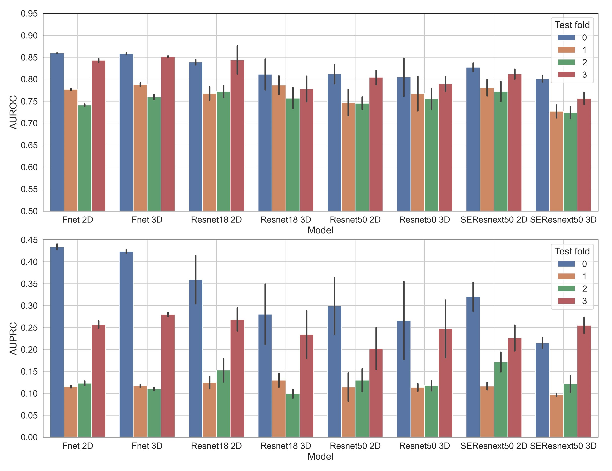

# CNN-based osteoporotic vertebral fracture prediction and risk assessment on MrOS CT data

**[Full paper as published in Annual Conference on Medical Image Understanding and Analysis (MIUA-2024)](https://link.springer.com/chapter/10.1007/978-3-031-66958-3_4)**

## Overview
Osteoporosis is a metabolic disease causing bone fragility, particularly affecting vertebral fracture risk.
Current clinical methods for fracture risk assessment have low sensitivities.
Convolutional neural networks (CNNs) offer promising diagnostic and prognostic capabilities in image analysis
This project presents a fully automatic pipeline for vertebral fracture risk assessment using a prognostic CNN.
The repository contains code for training and evaluation of prognostic-CNN with 2 different backbone architecture, in
as well as 2D and 3D.

The results of the experiments are in par with state of the art, achieving AUROC of about 81.5%,
C-index of 78% and a sHR of 2.6.


| Classifier    | #params | AUROC ± SD       | AUPRC ± SD       | C-index (95% CI) | sHR (95% CI)       |
|---------------|---------|------------------|------------------|------------------|--------------------|
| 2D fNet       | 0.39M   | 80.5 ± 5.7       | 23.2 ± 14.9      | 77 (71–83)       | 2.6 (2.2–3.2)      |
| 3D fNet       | 1.17M   | 81.5 ± 4.7       | 23.1 ± 14.6      | 78 (70–83)       | 2.5 (2.1–2.9)      |
| 2D ResNet18   | 11.17M  | 80.7 ± 4.4       | 25.0 ± 13.0      | 78 (71–83)       | 2.2 (1.9–2.5)      |
| 3D ResNet18   | 33.16M  | 75.9 ± 1.1       | 13.8 ± 3.1       | 75 (68–81)       | 2.2 (1.8–2.6)      |
| 2D ResNet50   | 21.28M  | 78.4 ± 3.1       | 19.6 ± 7.6       | 74 (67–81)       | 2.0 (1.7–2.3)      |
| 3D ResNet50   | 63.47M  | 75.3 ± 3.2       | 17.6 ± 7.4       | 72 (65–79)       | 1.9 (1.6–2.2)      |
| 2D SEResNeXt  | 25.51M  | 79.0 ± 3.8       | 20.3 ± 9.9       | 77 (70–84)       | 2.3 (2.0–2.7)      |
| 3D SEResNeXt  | 28.35M  | 75.1 ± 3.8       | 17.9 ± 7.6       | 75 (68–81)       | 2.3 (2.0–2.8)      |


We used the publicly available **[MrOS dataset](https://mrosonline.ucsf.edu/)** for the experiments.
Given the limited number of vertebral fracture cases within 10-year interval,
the results are reported on the test fold of the 4-fold nested Cross Validation setting as described in 
**[Don’t lose samples to estimation](http://dx.doi.org/10.1016/j.patter.2022.100612)**.
We also observed significant variation of performance across different test fold as can be
seen in the barplots.




If you find this work useful in your research, please consider citing:
```
@inproceedings{
  Shaikh2024CNNBasedOV,
  title={CNN-Based Osteoporotic Vertebral Fracture Prediction and Risk Assessment on MrOS CT Data: Impact of CNN Model Architecture},
  author={Mohd Faraz Shaikh and Eren Bora Yilmaz and O. Mercy Akinloye and Sandra Freitag-Wolf and Srinivas Kachavarapu and Nicolai R. Krekiehn and Claus-Christian Gl{\"u}er and Eric Orwoll and Carsten Meyer},
  booktitle={Annual Conference on Medical Image Understanding and Analysis},
  year={2024},
  url={https://api.semanticscholar.org/CorpusID:271770934}}
```


